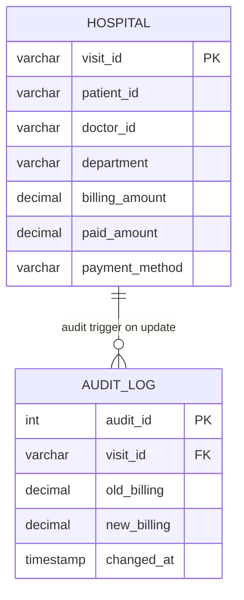
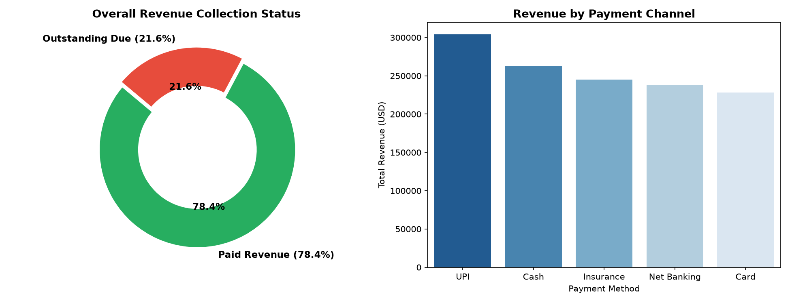
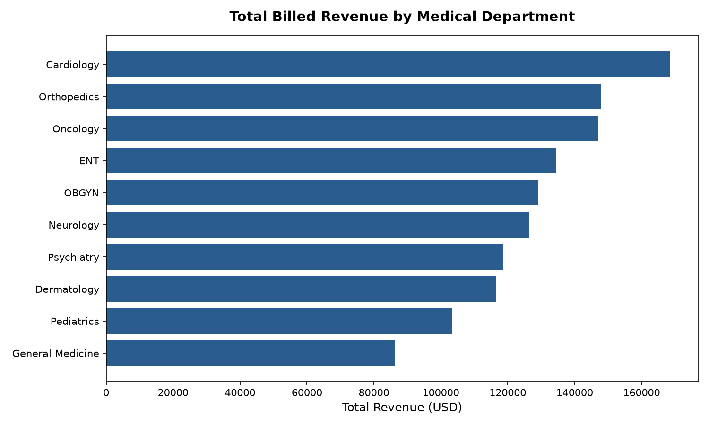

# 🏥 Hospital Patient Visit & Billing Management System

[](https://www.mysql.com/)
[](https://en.wikipedia.org/wiki/SQL)
[](https://github.com/jadavharsh109/Hospital-Patient-Visit-Billing-System)
[](https://www.linkedin.com/in/harshjadav0901/)
[](LICENSE)

An enterprise-style healthcare database management and financial analytics system built in **MySQL**. Features a 30-attribute clinical and financial dataset (500+ records) simulated across OPD, IPD, and Emergency visits, paired with stored procedures, views, and audit triggers for regulatory billing compliance.

---

## 📑 Table of Contents
- [📌 Problem Statement & Objectives](#-problem-statement--objectives)
- [📁 Project Structure](#-project-structure)
- [🗄️ Database Architecture & Schema](#️-database-architecture--schema)
- [📊 Key Financial & Operational Insights](#-key-financial--operational-insights)
  - [1. Hospital Revenue & Collection Efficiency](#1-hospital-revenue--collection-efficiency)
  - [2. Departmental Revenue & Patient Footfall](#2-departmental-revenue--patient-footfall)
  - [3. Payment Channel Breakdown](#3-payment-channel-breakdown)
  - [4. Top Billing Patients & Doctor Workloads](#4-top-billing-patients--doctor-workloads)
- [⚙️ Stored Procedures & Audit Triggers](#️-stored-procedures--audit-triggers)
- [🛠️ Advanced SQL Techniques Featured](#️-advanced-sql-techniques-featured)
- [🚀 Quickstart & Setup Guide](#-quickstart--setup-guide)
- [👨‍💻 Author](#-author)

---

## 📌 Problem Statement & Objectives

Modern hospital administrators and healthcare financial managers face complex operational challenges:
* **Revenue Leakage:** Balancing billed charges against payments across diverse payment methods (Cash, Card, Insurance claims, Net Banking, UPI).
* **Billing Discrepancies & Regulatory Auditing:** Ensuring every change in patient billing amount is automatically tracked in an immutable audit log.
* **Operational Bottlenecks:** Evaluating patient footfall and average billing across different treatment departments (Cardiology, Oncology, Orthopedics, etc.).
* **Follow-up Adherence:** Identifying patients requiring clinical follow-up to optimize continuum of care and patient retention.

This project addresses these challenges through a relational database schema (`hospital_mgmt`), SQL automation routines (triggers and procedures), and KPI reporting views.

---

## 📁 Project Structure

```text
Hospital-Patient-Visit-Billing-System/
├── assets/
│   ├── department_revenue.png      # Visual chart: Revenue by medical department
│   └── billing_summary.png         # Visual chart: Collection rate & payment channels
├── data/
│   └── Patient_data.csv            # 500 clinical, demographic & billing records (30 columns)
├── sql/
│   ├── 01_schema.sql               # Database initialization, table definitions & import commands
│   └── hospital.sql                # 240+ lines of queries, views, stored procedures & triggers
├── LICENSE                         # MIT License
└── README.md                       # Comprehensive system documentation
```

---

## 🗄️ Database Architecture & Schema



### Data Schema Overview (30 Attributes)
| Domain | Key Columns | Description |
| :--- | :--- | :--- |
| **Patient Info** | `patient_id`, `patient_name`, `age`, `gender`, `city`, `state`, `country` | Demographics & patient residence |
| **Visit Details** | `visit_id` (PK), `visit_date`, `visit_type` (OPD/IPD/Emergency), `follow_up_flag` | Encounter type & follow-up tracking |
| **Clinical Care** | `doctor_id`, `doctor_name`, `department`, `diagnosis_code`, `procedure_code`, `medication` | Clinician details, diagnoses & medications |
| **Financial / Billing** | `billing_amount`, `paid_amount`, `payment_method`, `insurance_provider`, `other_charges` | Charges, insurance & settlement channels |
| **Audit Trail** | `audit_id` (PK), `visit_id`, `old_billing`, `new_billing`, `changed_at` | Automated log of billing adjustments |

---

## 📊 Key Financial & Operational Insights

### 1. Hospital Revenue & Collection Efficiency

<p align="center">
  
</p>

```sql
SELECT
    ROUND(SUM(billing_amount), 2) AS total_revenue,
    ROUND(SUM(paid_amount), 2) AS paid_revenue,
    ROUND(SUM(billing_amount - paid_amount), 2) AS outstanding_revenue,
    ROUND((SUM(paid_amount) / SUM(billing_amount)) * 100, 2) AS collection_percentage
FROM hospital;
```

**Financial KPI Summary:**
| Metric | Amount (USD) | Share (%) |
| :--- | :---: | :---: |
| **Total Billed Charges** | **$1,278,133.13** | 100.0% |
| **Total Revenue Collected** | **$1,001,494.00** | **78.36%** |
| **Total Outstanding Debt** | **$276,639.13** | **21.64%** |

> **Key Takeaway:** The hospital maintains a solid 78.36% collection rate, with $276,639 in outstanding receivables predominantly tied up in pending insurance claims and patient credit copays.

---

### 2. Departmental Revenue & Patient Footfall

<p align="center">
  
</p>

```sql
SELECT 
    department,
    COUNT(visit_id) AS total_visits,
    ROUND(SUM(billing_amount), 2) AS total_revenue,
    ROUND(SUM(paid_amount), 2) AS paid_revenue,
    ROUND(SUM(billing_amount - paid_amount), 2) AS outstanding_amount,
    ROUND(AVG(billing_amount), 2) AS avg_bill_per_visit
FROM hospital
GROUP BY department
ORDER BY total_revenue DESC;
```

**Departmental Performance Table:**
| Department | Patient Visits | Total Billed ($) | Collected ($) | Outstanding ($) | Avg Bill/Visit ($) |
| :--- | :---: | :---: | :---: | :---: | :---: |
| **Cardiology** | 65 | **$168,520.16** | $131,893.85 | $36,626.31 | $2,592.62 |
| **Orthopedics** | 53 | **$147,788.67** | $113,265.06 | $34,523.61 | $2,788.47 |
| **Oncology** | 48 | **$147,089.70** | $114,122.12 | $32,967.58 | **$3,064.37** |
| **ENT** | 50 | $134,514.88 | $102,349.42 | $32,165.46 | $2,690.30 |
| **OBGYN** | 50 | $128,935.15 | $106,699.07 | $22,236.08 | $2,578.70 |
| **Neurology** | 50 | $126,401.76 | $100,442.44 | $25,959.32 | $2,528.04 |
| **Psychiatry** | 50 | $118,637.89 | $91,704.91 | $26,932.98 | $2,372.76 |
| **Dermatology** | 49 | $116,619.98 | $91,619.58 | $25,000.40 | $2,379.99 |
| **Pediatrics** | 47 | $103,322.46 | $82,730.60 | $20,591.86 | $2,198.35 |
| **General Medicine** | 38 | $86,302.48 | $66,667.09 | $19,635.39 | $2,271.12 |

> **Key Takeaway:** **Cardiology** generates the highest gross revenue ($168.5k across 65 visits), while **Oncology** yields the highest average revenue per visit ($3,064.37) due to intensive diagnostic and procedural costs.

---

### 3. Payment Channel Breakdown

```sql
SELECT 
    payment_method,
    COUNT(visit_id) AS total_transactions,
    ROUND(SUM(billing_amount), 2) AS total_billed,
    ROUND(SUM(paid_amount), 2) AS total_collected
FROM hospital
GROUP BY payment_method
ORDER BY total_billed DESC;
```

**Channel Output:**
| Payment Method | Transactions | Total Billed ($) | Total Collected ($) |
| :--- | :---: | :---: | :---: |
| **UPI** | 110 | **$304,258.11** | $241,381.82 |
| **Cash** | 101 | $262,839.73 | $209,698.81 |
| **Insurance** | 93 | $244,954.10 | $184,708.20 |
| **Net Banking** | 96 | $237,723.77 | $180,930.56 |
| **Card** | 100 | $228,357.42 | $184,774.61 |

---

## ⚙️ Stored Procedures & Audit Triggers

### 1. Automated Payment Settlement Procedure
```sql
DELIMITER $$
CREATE PROCEDURE settle_payment(IN v_id VARCHAR(20), IN amt DECIMAL(10,2))
BEGIN
    UPDATE hospital
    SET paid_amount = paid_amount + amt
    WHERE visit_id = v_id;
END $$
DELIMITER ;
```

### 2. Immutable Audit Trigger
Tracks every modification to billing amounts in real-time to prevent unauthorized financial alterations:
```sql
DELIMITER $$
CREATE TRIGGER billing_update_audit
AFTER UPDATE ON hospital
FOR EACH ROW
BEGIN
    IF OLD.billing_amount <> NEW.billing_amount THEN
        INSERT INTO audit_log (visit_id, old_billing, new_billing, changed_at)
        VALUES (OLD.visit_id, OLD.billing_amount, NEW.billing_amount, NOW());
    END IF;
END $$
DELIMITER ;
```

---

## 🛠️ Advanced SQL Techniques Featured

* **Stored Procedures (`DELIMITER $$`):** Encapsulated transaction routines for modular payment processing and follow-up queuing.
* **Audit Triggers (`AFTER UPDATE`):** Automated financial compliance and logging into dedicated audit tables.
* **Database Views:**
  * `Doctor_Performance`: Pre-aggregated view tracking patient counts and revenue generation per clinician.
  * `Monthly_Billing_Summary1`: Time-series view monitoring billing volume trends.
* **Self-Joins & Subqueries:** Identifying patients who exceed the hospital's mean billing amount.
* **Window Functions:** Running totals, revenue percentiles, and clinician rank ordering.

---

## 🚀 Quickstart & Setup Guide

### 1. Clone the Repository
```bash
git clone https://github.com/jadavharsh109/Hospital-Patient-Visit-Billing-System.git
cd Hospital-Patient-Visit-Billing-System
```

### 2. Initialize Database & Tables
Run the initialization script in MySQL Workbench or terminal:
```bash
mysql -u root -p < sql/01_schema.sql
```

### 3. Import Clinical Data
* In **MySQL Workbench**, right-click `hospital_mgmt` -> `hospital` table -> select **Table Data Import Wizard**.
* Select `data/Patient_data.csv` and complete the import.

### 4. Execute Analysis Queries & Procedures
Open `sql/hospital.sql` in your SQL editor to run the analytical queries, views, stored procedures, and triggers.

---

## 👨‍💻 Author

**Harsh Jadav**  
*Data Analyst | Data Scientist*  
* LinkedIn: [harshjadav0901](https://www.linkedin.com/in/harshjadav0901/)  
* GitHub: [@jadavharsh109](https://github.com/jadavharsh109)  
* Email: [jadavharsh109@gmail.com](mailto:jadavharsh109@gmail.com)
